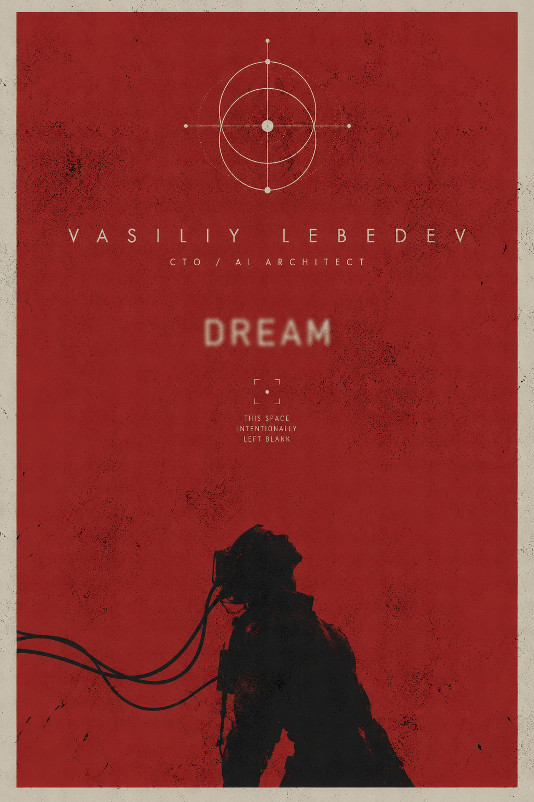

 

---

## `IDENTITY // PROFILE`

**I' AM** a **Python backend engineer, AI/ML architect and technical leader with 5+ years of commercial software engineering experience**. I moved from web development and backend engineering into designing and shipping **production AI systems**: LLM/RAG platforms, AI agents, voice AI, Document AI, Text-to-SQL, enterprise integrations and high-load Python services.

My strongest area is the boundary between **AI and real software engineering**: turning a model or prototype into an observable, testable and maintainable production system with APIs, databases, queues, validation, fallbacks, security boundaries and clear operational ownership.

I have worked on enterprise systems for **banking, telecom and fintech**, including projects associated with **VTB, Alfa-Bank, MegaFon, Beeline and Skyeng**. I also have **2+ years of CTO / technical leadership experience**, including architecture, technical roadmap, engineering processes, mentoring and translating business requirements into working systems.

> **RU / Кратко:** Python-разработчик и технический лидер с 5+ годами коммерческого опыта. Специализация: production AI/ML, LLM/RAG, AI-агенты, ASR/TTS, NLU, Document AI, Text-to-SQL, FastAPI/backend, интеграции и немного embedded/robotics. Работал с enterprise-клиентами из банковского сектора, телекома и финтеха.

**Availability:** project-based work, architecture reviews, AI/backend consulting and technical leadership.  
**Fastest contact:** [Telegram @gotogrub](https://t.me/gotogrub).

---

## `SYSTEM MAP // WHAT I BUILD`

<table>
<tr>
<td width="50%" valign="top">

### `AI SYSTEMS`

Production-oriented AI services rather than isolated demos.

**LLM · RAG · AI Agents · LangChain · LangGraph · Qdrant · ChromaDB · Ollama · OpenAI API · Hugging Face · structured output · guardrails · evaluation · local inference**

Typical work: retrieval pipelines, tool-using agents, controlled generation, multi-provider routing, local LLM deployment, business assistants and model evaluation.

</td>
<td width="50%" valign="top">

### `BACKEND / PLATFORM`

Backend architecture for systems that need to keep working after the demo.

**Python · FastAPI · Django · DRF · asyncio · PostgreSQL · Redis · RabbitMQ · Celery · REST · WebSocket · Docker · Kubernetes · Linux · CI/CD**

Typical work: microservices, asynchronous pipelines, API integrations, CRM/data flows, queues, caching, fault isolation and production reliability.

</td>
</tr>
<tr>
<td width="50%" valign="top">

### `VOICE / DOCUMENT / DATA`

AI pipelines connected to real business processes.

**ASR · TTS · NLU · OCR · OpenCV · Document AI · Text-to-SQL · ETL · analytics · CRM integrations**

Experience includes voice agents, document processing, information extraction, conversational systems, SQL generation and automation around enterprise data.

</td>
<td width="50%" valign="top">

### `EMBEDDED / ROBOTICS / UAV`

Software that eventually has to interact with actual physics. A deeply inconvenient but interesting constraint.

**C/C++ · basic Assembly · embedded Linux · UART · I2C · SPI · CAN · ArduPilot · SITL · Matek H743-class FC · telemetry · sensors · actuators**

Hands-on work includes flight-controller configuration, SITL validation, sensor/RC/ESC integration, failsafe logic, telemetry, DataFlash analysis and integration of robotics hardware with Python/AI services.

</td>
</tr>
</table>

---

## `SELECTED SYSTEMS // PUBLIC PROJECTS`

| System | What it is | Engineering focus |
|---|---|---|
| **[ScriptedLLM](https://github.com/gotogrub/ScriptedLLM)** | Constrained LLM agent framework for business chatbots where the model must follow a defined scenario and factual boundary. | Python, async architecture, FSM, validators, knowledge base, multi-provider LLM, Ollama/OpenAI/Anthropic |
| **[PhonePilot](https://github.com/gotogrub/PhonePilot)** | Fully local Android AI agent that sees the screen through a VLM and executes actions through ADB. | VLM agents, FastAPI, WebSocket, multi-device automation, local inference, Docker |
| **[GLaDOS](https://github.com/gotogrub/GLaDOS)** | Local multimodal voice assistant with Russian ASR/TTS, vision, LLM inference and an asynchronous robot mode. | ASR/TTS, local LLM, vision, asyncio, EventBus, streaming speech, robotics |
| **[AgentDesk](https://github.com/gotogrub/AgentDesk)** | Local command center for running multiple Codex CLI engineering tasks in parallel. | Agent orchestration, Git worktrees, FastAPI, process management, logs, diff/review workflow |
| **[Marketing AI Agent](https://github.com/gotogrub/marketing-ai-agent)** | Marketing analytics agent combining document retrieval, coded metrics and attribution with LLM explanations. | RAG, analytics, attribution, Hugging Face / GigaChat providers, SQLite, local KB |
| **[KR580VM80 Emulator](https://github.com/gotogrub/Emulator-KR580M80)** | Low-level Assembly project for the KR580VM80 / Intel 8080 architecture. | Assembly, registers, I/O ports, video buffer, low-level programming |

> More commercial systems and case studies are described on **[lebedev-systems.com](https://lebedev-systems.com/)** and in the **[engineering blog](https://lebedev-systems.com/blog)**. Some enterprise implementations are not public.

---

## `PRODUCTION EXPERIENCE // SIGNAL, NOT DEMOWARE`

My work has included **production voice AI, LLM/RAG services, Text-to-SQL, document automation, CRM integrations, backend microservices and internal AI tooling**. The systems I worked on were used in enterprise environments where latency, access control, observability, fallbacks and failure recovery mattered as much as model quality.

I prefer boring, explicit reliability over magical thinking. The model is one component of the system. It does not get to become the architecture just because somebody discovered a new API endpoint.

---

## `TECHNICAL LEADERSHIP // END-TO-END`

I have experience owning systems from the initial business problem to production: requirements discovery, architecture, technical decomposition, implementation, code review, deployment, observability and further iteration.

My technical leadership background includes **architecture reviews, product/engineering roadmaps, mentoring developers, defining engineering standards, reducing technical risk and balancing MVP speed against long-term maintainability**.

I am especially useful when a project sits between several domains at once: **AI + backend + data + infrastructure + integrations**, or when a prototype needs to stop behaving like a prototype.

---

## `STACK // INDEX`

**Languages & data:** Python, SQL, C++, JavaScript, TypeScript, PHP, basic Assembly · PostgreSQL, Redis, MySQL, SQLite, Qdrant, ChromaDB

**Backend:** FastAPI, Django, DRF, asyncio, Pydantic, SQLAlchemy, Alembic, REST, WebSocket, Node.js

**AI / ML:** LLM, RAG, AI agents, LangChain, LangGraph, PyTorch, Hugging Face, Ollama, OpenAI API, ASR, TTS, NLU, OCR, OpenCV, YOLO, VLM, Text-to-SQL, evaluation and guardrails

**Infrastructure:** Docker, Docker Compose, Kubernetes, Helm, Linux, Nginx, Git, CI/CD, RabbitMQ, Celery, Pytest

**Observability:** OpenTelemetry, Prometheus, Grafana, Jaeger, Langfuse, structured logging

**Embedded / UAV:** C/C++, embedded Linux, UART, I2C, SPI, CAN, ArduPilot, SITL, Matek H743-class flight controllers, telemetry, sensor/actuator integration, failsafe validation

---

## `CURRENT INTERESTS // R&D`

I am interested in **humanoid robotics, embodied AI, artificial life, low-level systems and human-machine interaction**. Long term, I want to work on systems where perception, language models, control software and physical machines are not separate disciplines but parts of one architecture.

That is also why I keep one foot in backend/AI infrastructure and another in embedded systems, flight controllers and robotics. Eventually the software has to leave the browser and deal with motors, sensors, latency and gravity. Gravity remains annoyingly production-critical.

---

### `OPEN CHANNEL // PROJECTS & CONSULTING`

I am currently open **only to project work, architecture and consulting engagements** around AI systems, Python backend, technical leadership and robotics/embedded integrations.

**[Website](https://lebedev-systems.com/)** · **[Blog](https://lebedev-systems.com/blog)** · **[GitHub](https://github.com/gotogrub)** · **[Hugging Face](https://huggingface.co/gotogrub)**

AI systems that work. Backend that survives production. Machines that eventually move.

